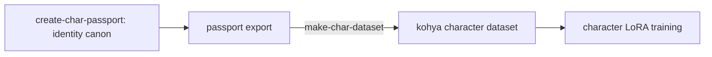

# make_char_dataset

> ComfyUI/diffusers image generation -> kohya-ready character LoRA dataset pipeline

[](https://github.com/hleserg/make_char_dataset/actions/workflows/ci.yml)
[](LICENSE)
[](https://www.python.org/)

[Русская версия](README-ru.md)

`make-char-dataset` turns a character's **passport set** — the golden reference
output of [create-char-passport](https://github.com/hleserg/create-char-passport)
(`state.json` + role-tagged `refs/`) — into a **kohya-ready character LoRA
dataset**. It is the *local multiplication* step of the comic-character pipeline:
a few identity anchors are multiplied into ~30–40 diverse, in-style variants using
a **pre-trained style LoRA** (Style Locker) and a license-safe img2img + ControlNet
backend, then deduplicated, captioned (Character-Locker), and laid out for kohya.

---

## How it fits the pipeline



Doctrine: **consistency in the character, diversity in everything else.** The paid
API (Nano Banana) fixes identity — the 5 passport frames plus optional
emotions/outfits/props — and this repo multiplies that canon locally. The art
**style is trained separately** (Style Locker) and loaded as an external LoRA at
generation time, so the character LoRA carries only face/body geometry and never
style. InsightFace-based tools (PuLID / IP-Adapter / InstantID) are avoided for the
commercial dataset; pose/structure comes from license-safe ControlNet.

Stages (see [docs/architecture/WORKSPACE.md](docs/architecture/WORKSPACE.md)):
`00_passport_import` → `01_generated` → `02_clean` (dedup) →
`03_dataset/<repeats>_<trigger>` (images + `.txt` captions), then an **opt-in**
`train` stage → `06_lora/<name>/<name>.safetensors`. The pipeline is resumable
(`.stage_complete` markers + `--force`) and the heavy generation backend is
injected behind a Protocol, so tests and CI run with no GPU.

The char-LoRA trains on **Flux.1-dev** so it stacks with the comic **style** LoRA
(`Flux + cmcstyle + <char>_char`). Training shells out to
[ostris **ai-toolkit**](https://github.com/ostris/ai-toolkit) — not kohya — because
only it can `qint4`-quantize the Flux base to fit ~16 GB VRAM. See
[docs/architecture/TRAINING.md](docs/architecture/TRAINING.md).

```bash
make-char-dataset doctor              # check the training env (no GPU)
make-char-dataset train --trigger kael   # -> 06_lora/kael/kael.safetensors
```

## Quickstart

```bash
uv sync --all-extras        # create .venv and install the light/CPU deps
cp .env.example .env        # fill in secrets + paths locally (never commit)
uv run make-char-dataset --version
make check                  # the Definition-of-Done gate
uv run python .claude/skills/verifier-dataset/smoke.py   # free no-GPU dataset check
```

## Project layout

| Path | Purpose |
|------|---------|
| `src/make_char_dataset/` | the package (src-layout, fully typed, ships `py.typed`) |
| `src/make_char_dataset/config.py` | typed settings via `pydantic-settings` |
| `src/make_char_dataset/workspace.py` | single-root workspace / stage-folder layout contract |
| `src/make_char_dataset/assembly.py` | pure dataset core: `Generator` Protocol, dedup, caption, kohya layout |
| `src/make_char_dataset/train.py` | opt-in char-LoRA training (Flux via ai-toolkit) behind a `Trainer` Protocol |
| `src/make_char_dataset/doctor.py` | training-environment validation (`make-char-dataset doctor`) |
| `src/make_char_dataset/observability/` | Sentry init (`send_default_pii=False`) + component tags |
| `.claude/skills/verifier-dataset/` | runtime dataset verifier (free no-GPU smoke + heavy GPU tier) |
| `tests/` | `unit/` + `integration/`, pytest with >=90% coverage gate |
| `docs/` | architecture (ADRs), development standard, PLAYBOOK marker spec |
| `scripts/` | `init_template.py`, `extract_playbook.py` |
| `tools/` | `check_instrumentation.py` (pre-commit guard) |
| `AGENTS.md` | canonical agent instructions (the open standard) |
| `CLAUDE.md` | imports `AGENTS.md` + Claude-specific notes |

## Make targets

```
make install     # uv sync --all-extras + pre-commit install
make check       # lint + fmt-check + type + security + tests  (DoD gate)
make test        # full test suite with coverage
make test-fast   # unit tests only, parallel, no coverage
make lint        # ruff check
make fmt         # ruff format
make type        # pyright
make playbook    # extract PLAYBOOK markers
```

## Tooling

- **uv** — environment & dependency management (lockfile committed)
- **ruff** — lint + format
- **pyright** — static type checking (standard mode)
- **pytest** — tests, >=90% coverage
- **bandit / pip-audit** — security
- **pre-commit** — local gate
- **commitizen** — conventional commits -> version bump + changelog
- **Sentry** — error/perf monitoring, privacy-first

## License

MIT — see [LICENSE](LICENSE). Note: if you fork copyleft code (e.g. AGPL), change this.
