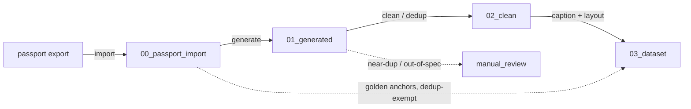

# System overview

`make-char-dataset` is a resumable, file-driven pipeline that multiplies a
character's golden **passport set** into a kohya-ready **character LoRA dataset**.
It is the local-generation step of the project pipeline: the paid Nano Banana API
(create-char-passport) fixes the *identity canon*; this repo multiplies that canon
into ~30–40 diverse, in-style variants locally.

## Doctrine

- **Consistency in the character, diversity in everything else.** Anything held
  constant and uncaptioned binds to identity, so we vary pose / plan / background /
  lighting and caption only what should vary.
- **Style is external (Style Locker).** Generation loads a pre-trained *style*
  LoRA + style prompt; character captions never contain style tokens, so the
  character LoRA carries only face/body geometry.
- **Use every incoming image.** The passport is mandatory; optional groups
  (emotions / outfits / props) are used when present. Golden anchors are used as
  conditioning and are **exempt from dedup**.
- **Commercially safe.** img2img + ControlNet (OpenPose/depth, Apache/MIT).
  InsightFace-based tools (PuLID / IP-Adapter / InstantID) are forbidden for the
  commercial dataset (HLE-668).

## Stages

| Stage | Folder | What |
|-------|--------|------|
| import | `00_passport_import/` | read a passport `state.json`, walk its pointers, role-tag + normalize the golden anchors |
| generate | `01_generated/` | multiply anchors into variants via the injected backend (ComfyUI/diffusers + style LoRA) |
| clean | `02_clean/` | perceptual-hash dedup + size filter of generated variants (anchors exempt) |
| caption + layout | `03_dataset/<repeats>_<trigger>/` | Character-Locker captions + kohya folder with `.txt` sidecars |
| — | `manual_review/` | anything kicked out for a human (near-dups, out-of-spec) |

## Components

- **config** — typed settings (`src/make_char_dataset/config.py`); the only place
  that reads the environment.
- **workspace** — single-root derived directory contract
  (`src/make_char_dataset/workspace.py`).
- **assembly** — pure dataset core: the `Generator` Protocol, perceptual-hash
  dedup, Character-Locker captioning, kohya layout (`assembly.py`). The heavy
  generation/captioning backends are injected behind Protocols and imported
  lazily, so the CPU/CI path never pulls torch/diffusers/onnxruntime.
- **observability** — Sentry init (`send_default_pii=False`) + component tagging.

## Data flow

## Idempotency

Each stage writes a `.stage_complete` marker into its output folder on success and
is skipped on re-runs unless `--force`. Stage enable flags (`APP_RUN_*`) gate which
stages `run-all` executes. See `docs/architecture/WORKSPACE.md`.
