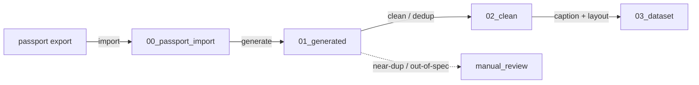

# System overview

`make-char-dataset` is a resumable, file-driven pipeline that multiplies a
character's golden **passport set** into a kohya-ready **character LoRA dataset**.
It is the local-generation step of the project pipeline: the paid Nano Banana API
(create-char-passport) fixes the *identity canon*; this repo multiplies that canon
into ~30–40 diverse, in-style variants locally.

## Doctrine

- **Consistency in the character, diversity in everything else.** Anything held
  constant and uncaptioned binds to identity, so we vary pose / plan / background /
  lighting and caption only what should vary.
- **Style is external (Style Locker).** Generation loads a pre-trained *style*
  LoRA + style prompt; character captions never contain style tokens, so the
  character LoRA carries only face/body geometry.
- **Use every incoming image — as generation conditioning.** The passport is
  mandatory; optional groups (emotions / outfits / props) are used when present.
  Golden anchors feed the **generate** stage as img2img / ControlNet references;
  they are **not** copied into the training set (their shared grey-studio
  background + neutral expression would otherwise bind to identity). The trained
  dataset is the locally generated variants only. `assemble_dataset(anchors=…)`
  remains an opt-in primitive for routing anchors through, but the default
  pipeline passes none.
- **Commercially safe.** img2img + ControlNet (OpenPose/depth, Apache/MIT).
  InsightFace-based tools (PuLID / IP-Adapter / InstantID) are forbidden for the
  commercial dataset (HLE-668).

## Stages

| Stage | Folder | What |
|-------|--------|------|
| import | `00_passport_import/` | read a passport `state.json`, walk its pointers, role-tag + normalize the golden anchors |
| generate | `01_generated/` | multiply anchors into variants via the injected backend (ComfyUI/diffusers + style LoRA) |
| clean | `02_clean/` | perceptual-hash dedup + size filter of the generated variants (anchors never enter this stage — they are generation conditioning only) |
| caption + layout | `03_dataset/<repeats>_<trigger>/` | Character-Locker captions + kohya folder with `.txt` sidecars |
| — | `manual_review/` | anything kicked out for a human (near-dups, out-of-spec) |

## Components

- **config** — typed settings (`src/make_char_dataset/config.py`); the only place
  that reads the environment.
- **workspace** — single-root derived directory contract
  (`src/make_char_dataset/workspace.py`).
- **assembly** — pure dataset core: perceptual-hash dedup, Character-Locker
  caption primitive, kohya layout (`assembly.py`).
- **stages** — one module per stage, building on the core: `ingest` (passport →
  `00_passport_import`), `generate` (anchors → variants, `GenerationBackend` +
  `backends/comfy.py`), `caption` (clean/dedup + Character-Locker layout) with
  `tagging` (`Tagger` Protocol → WD14). The heavy generation/captioning backends
  are injected behind Protocols and imported lazily, so the CPU/CI path never pulls
  torch/diffusers/onnxruntime.
- **orchestrate / cli** — `orchestrate.run_all` chains the stages (resumable,
  flag-gated); `cli.py` is the thin `make-char-dataset` console entry.
- **observability** — Sentry init (`send_default_pii=False`) + component tagging.

## Data flow



## Idempotency

Each stage writes a `.stage_complete` marker into its output folder on success and
is skipped on re-runs unless `--force`. Stage enable flags (`APP_RUN_*`) gate which
stages `run-all` executes. See `docs/architecture/WORKSPACE.md`.

## Running

```bash
# whole pipeline (import -> generate -> clean -> caption), resumable:
make-char-dataset run-all path/to/<character_id> --trigger kael --repeats 10
# or a single stage:
make-char-dataset generate            # uses 00_passport_import already on disk
make-char-dataset run-all path/to/export --force   # re-run every enabled stage
```

CI runs the whole pipeline hermetically on the stub backends (`APP_BACKEND=stub`,
the `StubTagger`) — no GPU, no network. The **heavy tier** (real ComfyUI img2img +
ControlNet + style LoRA, WD14 tagger; all human-provided inputs, HLE-759) is built
with `docker build --build-arg GPU=1` and run against a real create-char-passport
export. A genuine `kael-thornwood` passport fixture (`state.json` + 5 role-tagged
`refs/`) is kept out-of-repo for that end-to-end run; the free verifier
(`.claude/skills/verifier-dataset/smoke.py`) exercises the same `00→01→02→03`
contract on a synthetic export every PR.
