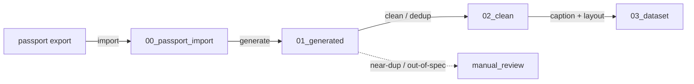

# Workspace layout contract

The pipeline is a sequence of stages that read and write folders under a single
**workspace root** (configured by `APP_WORKSPACE`, default `workspace/`). Every
path is derived from that root by
[`make_char_dataset.workspace.Workspace`](../../src/make_char_dataset/workspace.py),
so the whole pipeline can be relocated or sandboxed by changing one setting.

## Directory map

| Folder | Owner stage | Contents |
|--------|-------------|----------|
| `00_passport_import/` | `import` | Role-tagged golden anchors imported from a create-char-passport export (`state.json` + `refs/`); they serve as **conditioning** for `generate`, not as training images. |
| `01_generated/` | `generate` | Raw variants produced by the generation backend (ComfyUI/diffusers + external style LoRA). |
| `02_clean/` | `clean` | Deduplicated, size-filtered generated variants. (Golden anchors are conditioning for `generate` only and never reach this stage.) |
| `03_dataset/<N>_<trigger>/` | `caption` | kohya-ready images + `.txt` caption sidecars. |
| `manual_review/` | *(any stage)* | Near-duplicates, out-of-spec frames, or anything kicked out for a human. |

`<N>` is `APP_DATASET_REPEATS` and `<trigger>` is `APP_TRIGGER_TOKEN`, so the
caption stage writes to e.g. `03_dataset/10_conan/` — the folder-name convention
[kohya_ss](https://github.com/bmaltais/kohya_ss) uses to encode the per-image
repeat count for LoRA training. Here the trigger names the **character** (unlike
make-style-dataset, where it names the style).

## Input contract (create-char-passport export)

The `import` stage consumes a per-character folder produced by
[create-char-passport](https://github.com/hleserg/create-char-passport):

```
<character_id>/
  state.json   # full character state; the authoritative index
  refs/        # golden anchors: passport_{face,body,profile,back,3q}.png
               #   (+ optional style.png / emotion_* / outfit_* / prop_*)
  approved/    # dataset-phase composites (currently unbuilt upstream)
  rejected/    # superseded attempts (never deleted; opt-in augmentation only)
```

Enumerate inputs by **walking the pointers in `state.json`** (`approved_path`,
`style_ref`, `outfits[].refs.*`, `props[].shots[].ref`, `emotions.items[].ref`, …)
— never by globbing directories, because outfit/prop filenames are not derivable
from the step key. Paths are relative to the character folder. The 5 passport
frames are **mandatory**; optional groups are used when present.
`current_step == null` means the character is complete and ready to consume.

## Data flow



## Idempotency

Each stage writes a `.stage_complete` marker into its output folder on success and
is **skipped on re-runs** unless `--force` is passed. This makes re-running a
partially-finished pipeline safe and cheap. Stage enable flags (`APP_RUN_*`) gate
which stages `run-all` executes; an explicit single-stage invocation always runs
regardless of its flag.
